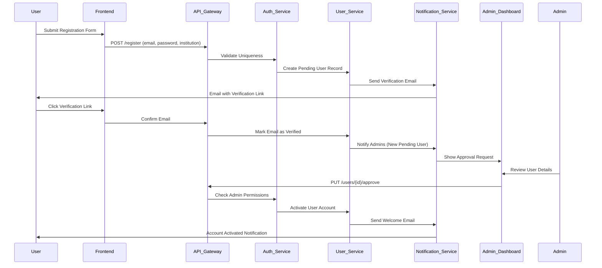
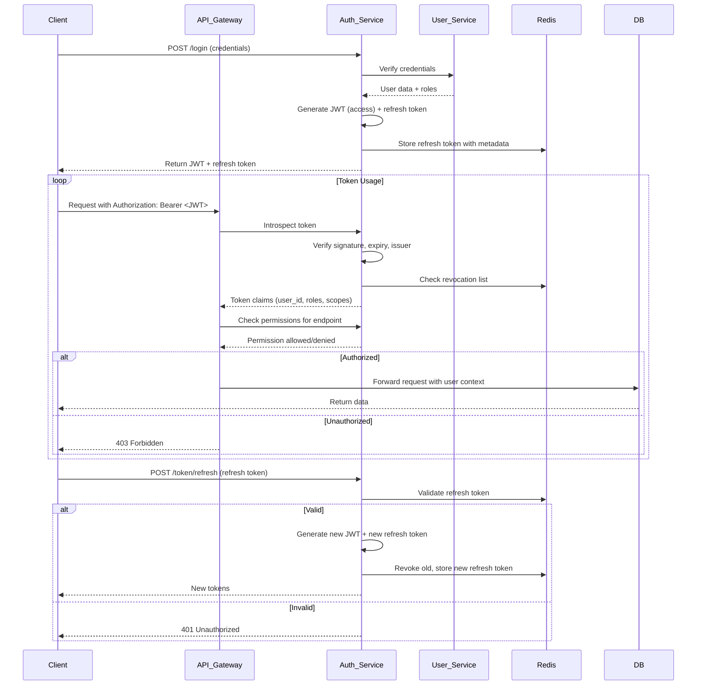

# Research Lab Management Web App

A comprehensive web application designed for managing research labs at universities. It facilitates interactions between **Professors**, **Doctorants (PhD Students)**, and **Admins**, and includes features such as supervision, collaboration, file sharing, notifications, activity tracking, and more.

## Features

- **User Roles & Permissions**
  - **Admin**: Manages user registrations, roles, and permissions.
  - **Professor**: Supervises Doctorants and manages research activities , Upload researchs and conferences.
  - **Doctorant**: Participates in research, uploads papers, and communicates with Professors.
  - **External Professor**: External supervisor with limited permissions.

- **Communication & Collaboration**
  - **Chat**: Real-time messaging between users.
  - **Group Chats**: Create and participate in group discussions.
  - **Follow Research Topics**: Follow specific research areas or tags.

- **Research Management**
  - **Upload Research**: Upload research papers, conference submissions, and presentations.
  - **Version Control**: Track changes to uploaded research.

- **Activity Tracking**
  - **Activity Log**: Track all user activities and system events.

- **Notifications & Alerts**
  - **User Notifications**: Professors are notified of new Doctorants in their department. Users receive updates about follows, uploads, and messages.

- **Security**
  - **Multi-Factor Authentication (MFA)**: Secure login with support for JWT and biometric login.

## Technologies Used

- **Frontend**: Next.js
- **Backend**: Node.js 
- **Database**: PostgreSQL 
- **Authentication**: JWT tokens + Biometric Login
- **Version Control**: Git, GitHub

## Setup & Installation

### Prerequisites

- Node.js .
- NPM .
- PostgreSQL 

### Steps

1. **Clone the repository**:

    ```bash
    git clone https://github.com/yourusername/research-lab-management.git
    cd research-lab-management
    ```

2. **Install dependencies**:

    ```bash
    npm install
    ```

3. **Set up the database**:
   - Build the container running PostgreSQL.
   
4. **Run the development server**:

    ```bash
    npm run development
    ```

5. **Open the app**:
   - Open `http://localhost:3000` in your web browser.

## License

This project is licensed under the MIT License.

## Diagrams 

User Registration Diagram :



Authentication Diagram 

Class Diagram :

```mermaid
classDiagram
    class Users {
        +UUID id PK
        +VARCHAR email UNIQUE
        +VARCHAR password_hash
        +VARCHAR first_name
        +VARCHAR last_name
        +VARCHAR avatar_url
        +BOOLEAN is_active
        +TIMESTAMP created_at
        +TIMESTAMP last_login
        +TIMESTAMP last_updated_at
        +UUID supervisor_id FK
    }

    class Roles {
        +UUID id PK
        +VARCHAR name
        <<Possible values: Admin, Professor, Doctorant, External Professor>>
    }

    class Permissions {
        +UUID id PK
        +VARCHAR name
    }

    class RolePermissions {
        +UUID role_id PK, FK
        +UUID permission_id PK, FK
    }

    class UserRoles {
        +UUID user_id PK, FK
        +UUID role_id PK, FK
    }

    class Publications {
        +UUID id PK
        +VARCHAR title
        +VARCHAR status
        +UUID submitter_id FK
        +TIMESTAMP submitted_at
        +TEXT[] keywords
        +TEXT content
    }

    class PublicationFiles {
        +UUID id PK
        +UUID publication_id FK
        +VARCHAR storage_path
        +VARCHAR file_type
    }

    class PublicationAuthors {
        +UUID publication_id PK, FK
        +UUID user_id PK, FK
    }

    class Chats {
        +UUID id PK
        +UUID user1_id FK
        +UUID user2_id FK
        +TIMESTAMP started_at
        +TIMESTAMP last_message_at
    }

    class GroupChats {
        +UUID id PK
        +VARCHAR name
        +TIMESTAMP created_at
    }

    class GroupChatMembers {
        +UUID group_chat_id PK, FK
        +UUID user_id PK, FK
        +TIMESTAMP joined_at
    }

    class Messages {
        +UUID id PK
        +UUID chat_id FK  
        +UUID sender_id FK
        +TEXT content
        +BOOLEAN is_read
        +TIMESTAMP sent_at
    }

    class ResearchTopics {
        +UUID id PK
        +VARCHAR name
        +TEXT description
    }

    class UserResearchTopics {
        +UUID user_id PK, FK
        +UUID research_topic_id PK, FK
        +TIMESTAMP followed_at
    }

    class Notifications {
        +UUID id PK
        +UUID user_id FK
        +VARCHAR type
        +VARCHAR title
        +TEXT message
        +BOOLEAN is_read
        +TIMESTAMP created_at
    }

    class Comments {
        +UUID id PK
        +UUID publication_id FK
        +UUID author_id FK
        +TEXT content
        +UUID parent_id FK
        +TIMESTAMP posted_at
        +BOOLEAN is_edited
    }

    class ActivityLog {
        +UUID id PK
        +UUID user_id FK
        +VARCHAR action
        +TIMESTAMP created_at
    }

    Users "1" --> "*" UserRoles : "assigned"
    Roles "1" --> "*" UserRoles : "grants"
    Roles "1" --> "*" RolePermissions : "grants"
    Permissions "1" --> "*" RolePermissions : "assigned to"

    Users "1" --> "*" Publications : "submits"
    Publications "1" --> "*" PublicationFiles : "has"
    Publications "1" --> "*" PublicationAuthors : "written by"
    Users "1" --> "*" PublicationAuthors : "co-author of"

    Users "1" --> "*" Chats : "initiates"
    Chats "1" --> "*" Messages : "contains"
    Users "1" --> "*" Messages : "sends"

    GroupChats "1" --> "*" GroupChatMembers : "has"
    Users "1" --> "*" GroupChatMembers : "member"
    GroupChats "1" --> "*" Messages : "contains"  %% Group messages

    Users "1" --> "*" Notifications : "receives"

    Publications "1" --> "*" Comments : "has"
    Users "1" --> "*" Comments : "writes"
    Comments "0..1" --> "*" Comments : "replies to"

    Users "1" --> "*" UserResearchTopics : "follows"
    ResearchTopics "1" --> "*" UserResearchTopics : "followed by"

    Users "1" --> "*" ActivityLog : "generates"

    Users "1" --> "*" Users : "supervises"
```

