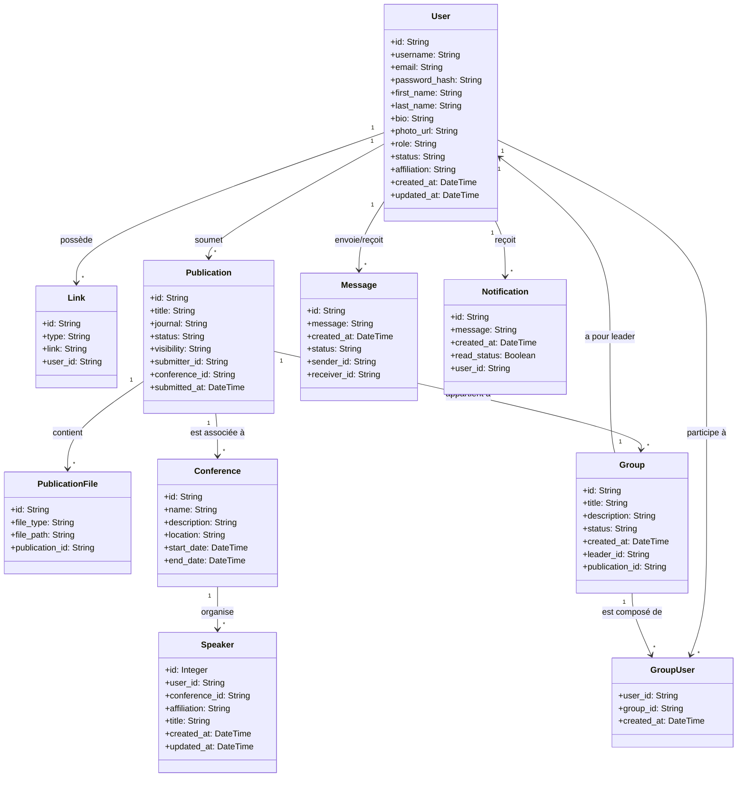

# 🧪 Research Lab Management Web App

A full-stack web application for managing research publications, groups, and user collaboration within a laboratory environment. Built with **Rust (SQLx)** and **Node.js** on the backend, and **Next.js** on the frontend.

---

## 🚀 Features

### ✅ User Management
- Register and manage user accounts
- Roles: `admin`, `researcher`, `leader`
- Secure password storage using hashes
- Email format validation

### 📚 Publications
- Submit, update, and track publication status (`DRAFT`, `WAITING`, `APPROVED`)
- Upload and manage associated files
- Link publications to submitting researchers

### 👥 Group Collaboration
- Create and manage research groups
- Assign leaders to groups
- Add users to groups
- Group status: `OPENED`, `CLOSED`, `DELETED`

### 🗃️ Database Schema (PostgreSQL)
- Well-structured tables for users, publications, publication files, and groups
- Foreign key relationships to enforce data integrity

---

## 🛠️ Tech Stack

### Backend
- **Rust**: Safe and performant web backend
- **SQLx**: Async PostgreSQL driver with compile-time SQL checking
- **Actix-Web**: Fast and powerful web framework
- **Node.js**: Optional support for additional backend microservices

### Frontend
- **Next.js**: React-based framework for SSR and SPA capabilities

### Database
- **PostgreSQL**: Reliable and scalable relational database

## Setup & Installation

### Prerequisites
- Rust toolchain
- docker compose
- Node.js .
- NPM .
- PostgreSQL 

## Diagrams 

## License

This project is licensed under the MIT License.
